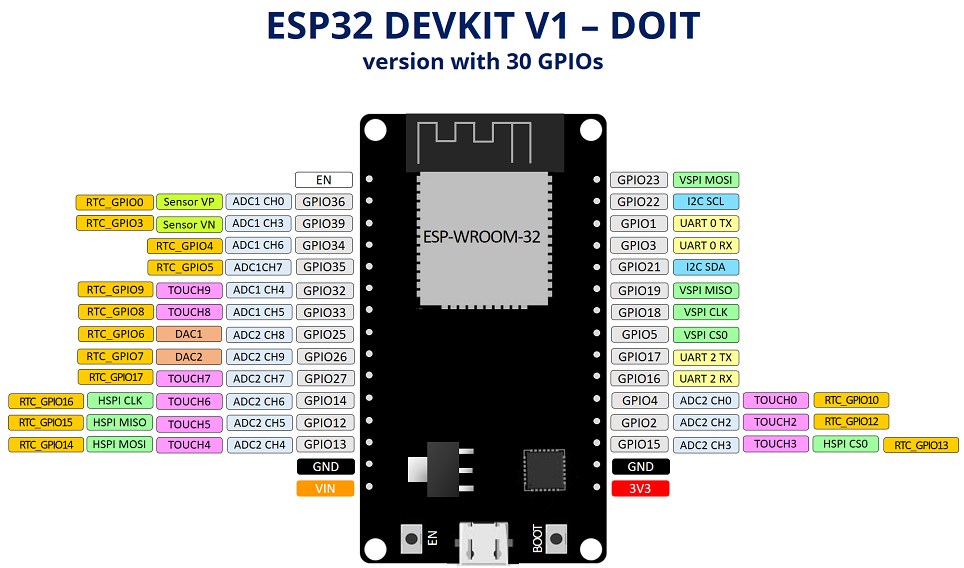
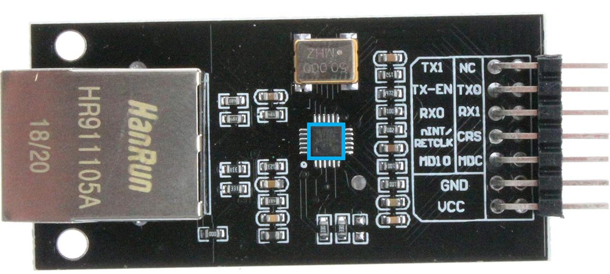
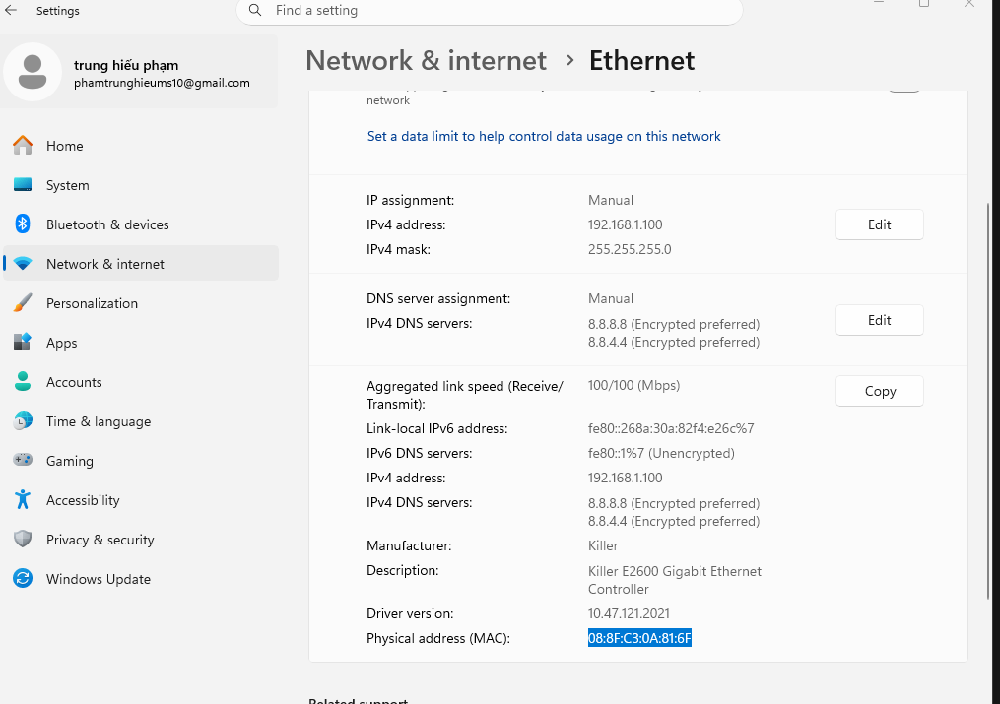
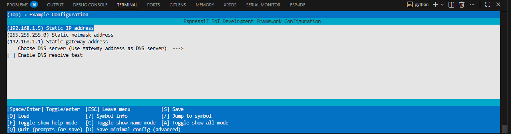
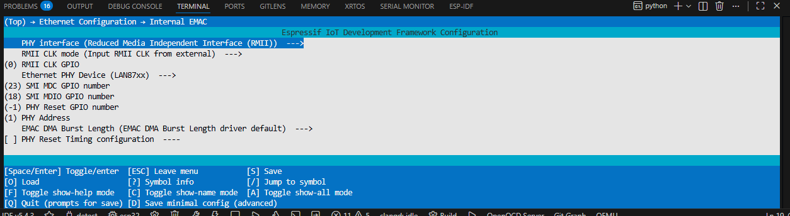
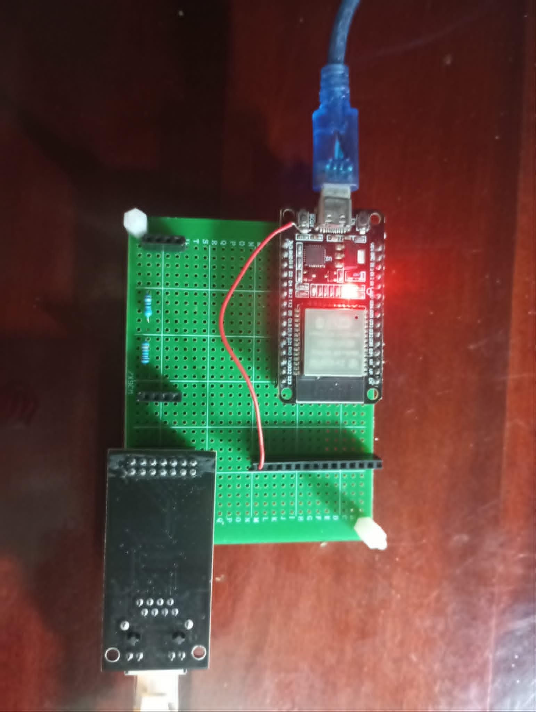
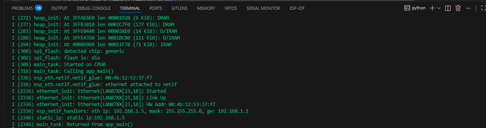

# ESP32 + LAN8720 Ethernet — Static IP


---

## 1. Tại sao dùng RMII + Static IP?

### RMII (Reduced Media Independent Interface)

ESP32 hỗ trợ kết nối Ethernet thông qua giao thức **RMII** — đây là chuẩn giao tiếp giữa MAC (trong ESP32) và PHY (LAN8720).

```
ESP32 (MAC)  ←──RMII──→  LAN8720 (PHY)  ←──→  RJ45 (mạng vật lý)
```

**Tại sao dùng RMII thay vì SPI Ethernet (W5500,...)?**

| | RMII (LAN8720) | SPI Ethernet (W5500) |
|---|---|---|
| Tốc độ | 100 Mbps | 80 Mbps |
| Số chân | ~9 chân | 4 chân (SPI) |
| CPU load | Thấp (hardware MAC) | Cao hơn |
| Độ trễ | Thấp | Cao hơn |
| Phù hợp | Truyền dữ liệu liên tục | Ứng dụng đơn giản |

→ **LAN8720 + RMII** phù hợp hơn khi cần truyền dữ liệu nhanh, ổn định, CPU load thấp.

### Static IP

Thay vì dùng DHCP (xin IP từ router), Static IP gán cố định địa chỉ IP cho ESP32.

**Tại sao dùng Static IP?**

```
DHCP:
  ❌ IP thay đổi mỗi lần kết nối
  ❌ Phải tìm IP mỗi lần debug
  ❌ Cần có router/DHCP server

Static IP:
  ✅ IP cố định, dễ kết nối
  ✅ Kết nối thẳng PC ↔ ESP32
     không cần router
  ✅ Phù hợp cho embedded system
```

---

## 2. Ví dụ dựa trên example `static_ip`

Project này được copy và chỉnh sửa từ example chính thức của ESP-IDF:

```
$IDF_PATH/examples/ethernet/basic/
```

Các thay đổi so với example gốc:

- Đổi từ DHCP sang **Static IP**
- Cấu hình địa chỉ IP cố định:
  ```c
  #define STATIC_IP      "192.168.1.5"
  #define STATIC_NETMASK "255.255.255.0"
  #define STATIC_GW      "192.168.1.1"
  ```
- Dùng **LAN8720** với clock từ IO0 (RMII CLK mode)

---

## 3. Cài đặt Ethernet bên Laptop để kết nối với ESP32

### Bước 1 — Cắm dây mạng
```
Laptop (RJ45) ←──── Dây mạng ────→ ESP32 + LAN8720 (RJ45)
```
> Dùng dây thẳng (straight) hoặc dây chéo (crossover) đều được,
> card mạng hiện đại tự nhận.

### Bước 2 — Cài IP tĩnh cho Laptop (Windows)
<!-- Ảnh đơn giản -->

```
1. Control Panel
   → Network and Internet
   → Network and Sharing Center
   → Change adapter settings

2. Click phải vào Ethernet adapter
   → Properties

3. Chọn Internet Protocol Version 4 (TCP/IPv4)
   → Properties

4. Chọn "Use the following IP address":
   IP address:       192.168.1.10
   Subnet mask:      255.255.255.0
   Default gateway:  (để trống)

5. OK → OK
```

### Bước 3 — Kiểm tra kết nối

```bash
# Mở CMD hoặc Terminal
ping 192.168.1.5

# Kết quả mong đợi:
Reply from 192.168.1.5: bytes=32 time<1ms TTL=255
```

### Lưu ý

```
ESP32 IP:    192.168.1.5   (cố định trong code)
Laptop IP:   192.168.1.10  (cài thủ công)
Cùng subnet: 192.168.1.x   ✅
```

---

## 4. Chân RMII — Default

| Chân ESP32 | Chức năng RMII | Nối tới LAN8720 |
|---|---|---|
| IO21 | TX_EN | TXEN |
| IO19 | TXD0 | TXD0 |
| IO22 | TXD1 | TXD1 |
| IO25 | RXD0 | RXD0 |
| IO26 | RXD1 | RXD1 |
| IO27 | CRS_DV | CRS_DV |
| IO0  | REF_CLK | XTAL IN / CLK OUT |
| IO23 | MDC | MDC |
| IO18 | MDIO | MDIO |

> **IO0 = REF_CLK**: LAN8720 xuất clock 50MHz vào IO0 của ESP32
> → Đây là lý do IO0 không thể dùng để kéo GND khi flash bình thường

### Sơ đồ kết nối tóm tắt

```
ESP32                    LAN8720
─────                    ───────
IO0   ←────────────────  CLK OUT (50MHz)
IO19  ──────────────────→ TXD0
IO22  ──────────────────→ TXD1
IO21  ──────────────────→ TX_EN
IO25  ←────────────────  RXD0
IO26  ←────────────────  RXD1
IO27  ←────────────────  CRS_DV
IO23  ──────────────────→ MDC
IO18  ←─────────────────→ MDIO
3.3V  ──────────────────→ VCC
GND   ──────────────────→ GND
```

---

## 5. Cấu hình Menuconfig


Các mục cần chỉnh trong `idf.py menuconfig`:

```
Component config
  └─ Ethernet
       └─ [✅] Support ESP32 internal EMAC controller
            └─ PHY interface: RMII
            └─ RMII clock mode: Input RMII clock from external crystal oscillator
            └─ RMII clock GPIO: 0  (IO0)
            └─ PHY address: 1
            └─ [✅] LAN87xx

Example config (nếu dùng example):
  └─ IP address: 192.168.1.5
  └─ Netmask:    255.255.255.0
  └─ Gateway:    192.168.1.1
```

---

## 6. Flash & Run

```bash
# Build
idf.py build

# Flash (lưu ý IO0)
idf.py -p COMx flash

# Monitor
idf.py -p COMx monitor
```

### Lưu ý khi flash (do IO0 nối LAN8720)

```
1. Ngắt kết nối IO0 khỏi LAN8720
2. idf.py flash
3. Nhấn Reset → ESP32 vào boot mode
4. nối lại IO0 với LAN8720
5. → chạy bình thường
```

---

## 7. Log khởi động bình thường

```
I (2236) ethernet_init: Ethernet(LAN87XX) Started
I (2236) ethernet_init: Ethernet(LAN87XX) Link Up
I (2236) ethernet_init: Ethernet(LAN87XX) HW Addr 00:4b:12:53:37:f7
I (2236) esp_netif_handlers: eth ip: 192.168.1.5
I (2246) static_ip: static ip:192.168.1.5
```

---

*ESP-IDF v5.4.3 — ESP32 + LAN8720 RMII Ethernet*